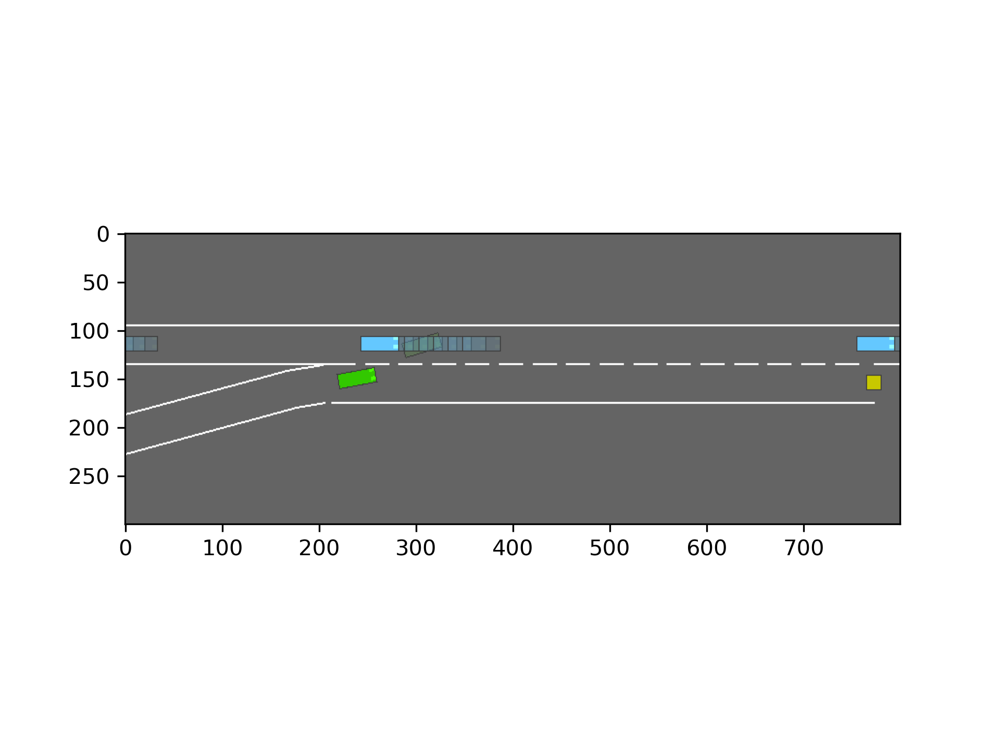
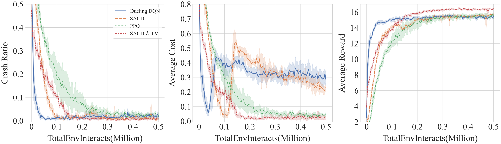
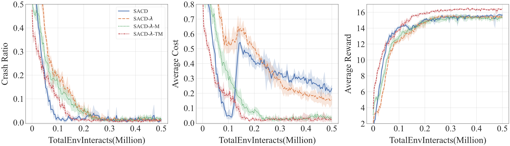

# Human-aligned Safe Reinforcement Learning for Highway On-ramp Merging in Dense Traffic
This is the official implementation of the paper: [Human-aligned Safe Reinforcement Learning for Highway On-ramp Merging in Dense Traffic]. The code is based on [highway-env](http://highway-env.farama.org/).

## 1. Setup Environment
We use [conda](https://docs.conda.io/en/latest/) to manage our environment. To create the environment, run
```bash
conda create -n on_ramp_merge python=3.8
conda activate on_ramp_merge
```
and we also highly recommend you install the openmpi for the parallel training:
```bash
cd ~/Downloads
wget https://download.open-mpi.org/release/open-mpi/v4.1/openmpi-4.1.2.tar.gz
tar -xzvf openmpi-4.1.2.tar.gz
cd openmpi-4.1.2
./configure
make && make install
```
then you need to install the requirements:
```bash
git clone https://github.com/wenqing-2021/On_Ramp_Merge_Safe_RL.git
cd On_Ramp_Merge_Safe_RL
pip install setuptools==65.5.0
pip install --user wheel==0.38.0
pip install -r requirement.txt
```
Note: we use wandb to log the training process, so you need to create an account on [wandb](https://wandb.ai/) and login with your account. Here is the tutorial for [quick_start](https://docs.wandb.ai/quickstart).

## 2. Train agents
The environment is secondly developed based on [highway-env](http://highway-env.farama.org/) and we implemented the Model Predictive Controller (MPC) and the Safe Reinforcement Learning (SRL) algorithms which consider the cost constraints for the on-ramp merging task.
Run the following scripts for easily training:
### 2.1 Choose the Agent:
- SACD_baseline (NO LAGRANGIAN):
```bash
python3 src/agent/sac_discrete_original.py
```
- SACD_Lagrangian:
```bash
python3 src/agent/sac_discrete_nstep.py
```
- SACD_Lagrangian_MPC (Proposed):
```bash
python3 src/agent/sac_discrete_nstep.py --safe_check
```
- PPO_baseline (NO LAGRANGIAN):
```bash
python3 src/agent/ppo_baseline.py
```
- PPO_Lagrangian:
```bash
python3 src/agent/ppo_lagrangian.py
```
- Dueling_DQN:
```bash
python3 src/agent/dueling_dqn.py
```
### 2.2 Parameters:
- --safe_check: whether to use action shield module
- --env: the environment name, optional: `[merge_game_env-v0, merge_eval_high_density-v0, merge_eval_low_density-v0]`
- --cost_limit: the cost limit for the lagrangian algorithms
- --n_step: the n-step to estimate the return
- --seed: the random seed
---
Note: 
1. if you want to change the predictive steps, you can change the config in the environment file: `highway_env/envs/merge_game_env.py`
2. the trained data will be stored in the root folder: `./data/`

## 3. Evaluate agents
Run the following scripts to evaluate the trained agent:
NOTE: the `--exp_name` is suggested as the format: `eval_in_${density}`, where the density is within the choices of low, high, mixed.
After running the following scripts, the eval results will be stored in the root folder: `./eval_result/baseline/eval_in_low_Baseline_SACD_2/`
```bash
python3 src/evaluate/evaluate_agents.py --exp_name eval_in_low --env merge_eval_low_density-v0 --safe_protect --data_file baseline --agents Baseline_SACD_2
```
### 3.1 Parameters:
- --safe_protect: whether to use action shield module
- --exp_name: the save_name
- --agents: the prepared agents for evaluation
- --print_freq: the frequency to print the evaluation results
- --eval_episodes: the evaluation episodes
- --env: the environment name for evaluation

### 3.2 Render the evaluation process
- --render: whether to render the evaluation process. Note: you must train the agent first.
```bash
python3 src/evaluate/evaluate_agents.py --exp_name eval_in_low --env merge_eval_low_density-v0 --safe_protect --data_file baseline --agents Baseline_SACD_2 --cpu 1 --render
```
and you can see the driving process like this:


## 4. Plot tools
The plot tools have been implemented in the folder tools/. We suggest the audience to read the source code for more information. The main training results are shown in the following graphs:




